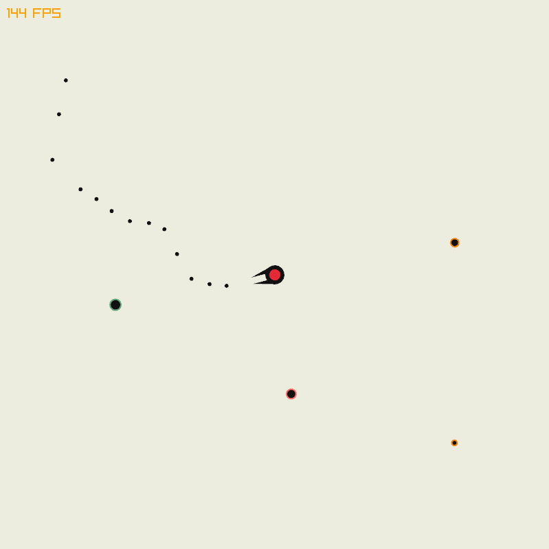

# Gundling

Gundling is an action-packed 2D shooter game developed in the [Zig](https://ziglang.org/) programming language with graphics powered by the [Raylib](https://www.raylib.com/) library. In the game, you take control of a centrally positioned gun. Waves of enemies appear every second, and each hit from them reduces your health. Your goal is to survive these relentless attacks for as long as possible. Brace yourself for an intense battle and strive to fight till the last breath!

## Installing / Getting started

* Zig 0.12.0+

## Building

```sh
zig build
```

## Run

```sh
zig build run
```

## Licensing

The code in this project is licensed under MIT license. Check [LICENSE](LICENSE) for further details.